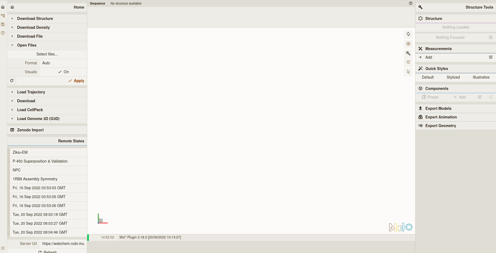
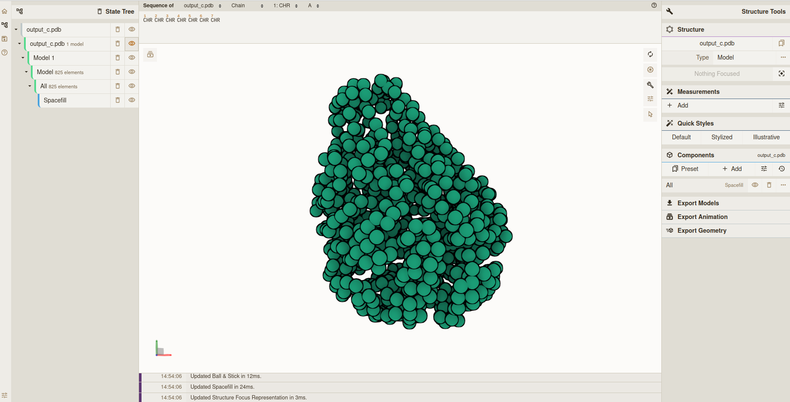
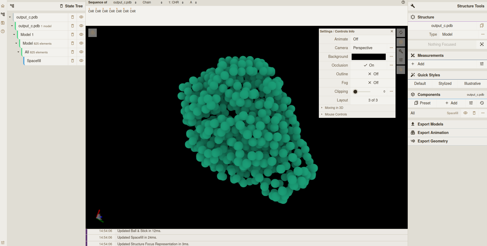
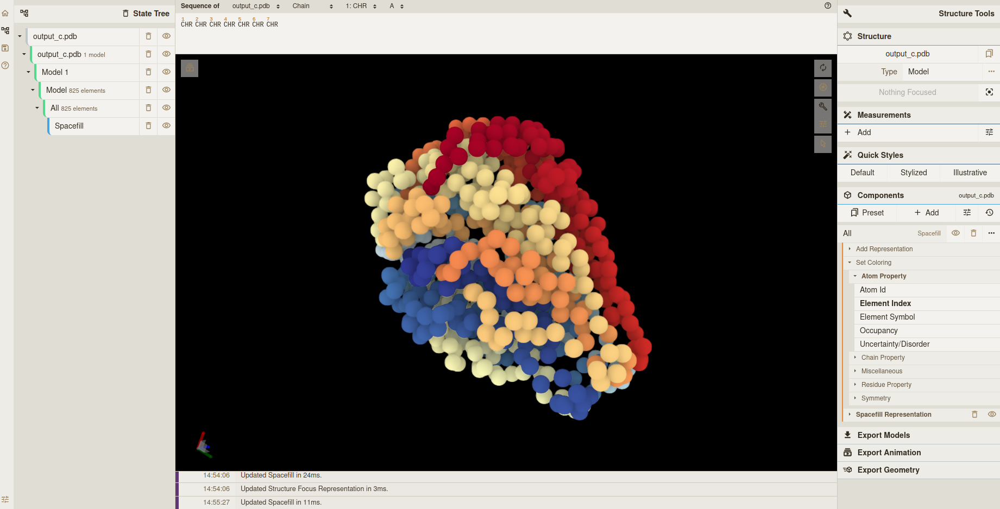
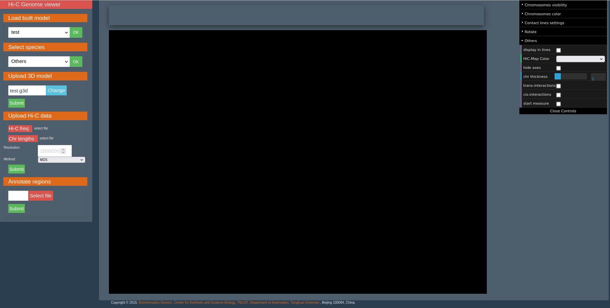
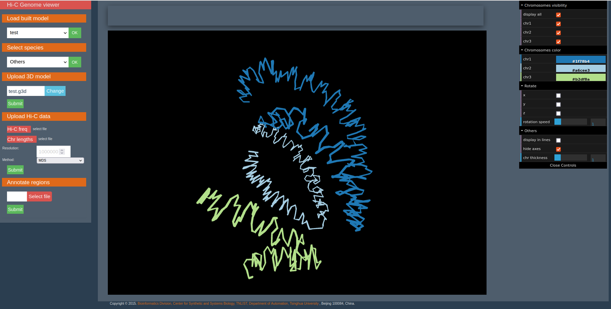

# Genome 3D models visualization

3D models produced by the 3DGB workflow are a list of beads with x, y and z coordinates. These coordinates are formatted as .pdb and .g3d files.

- .pdb files can be opened by molecular viewers (e.g. Pymol, NGLViewer, Mol*...)
- .g3d files can be opened by 3D genome structures viewers (e.g. WashU or HiC3D-Viewer).

## How to open a 3D genome structure .pdb file with Mol*?

The manual of Mol* is available [here](https://molstar.org/viewer-docs/).

1. To load the 3D model, click on "Open Files" on the left menu. Select your .pdb file then click "Apply".

2. To view the 3D model as beads, click on the "Illustrative" *Quick Styles* on the right menu.

 

3. To change the background color or turn off the outline, use the menu on the right corner of the middle interface.

 

4. To change the structure color, click on *Components* on the right menu, then "all", then "Set coloring" and choose the appropriate parameter.

## How to open a 3D genome structure .g3d file with HiC3D-Viewer?

The manual of HiC3D-Viewer is available [here](https://github.com/mohamed-amine-guerras/HiC3DViewer/blob/master/hicViewer/static/data/UserManual.pdf).

1. To load the 3D model, click on "Select file" from the "Upload 3D model" left menu. Select your .g3d file, then click on "Submit". Once the model is uploaded, select the model in the "Load built model" menu then click "OK". 

2. To change chromosome colors and thickness or hide axes, use the right menu.

